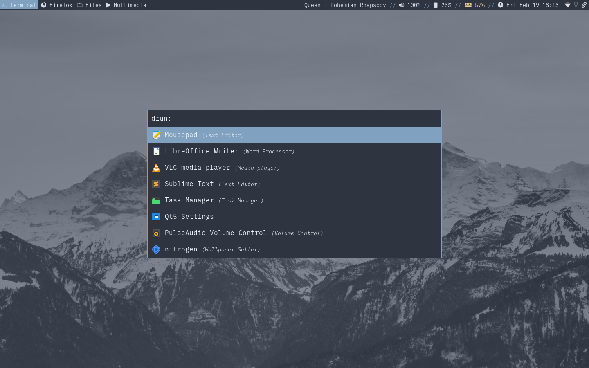
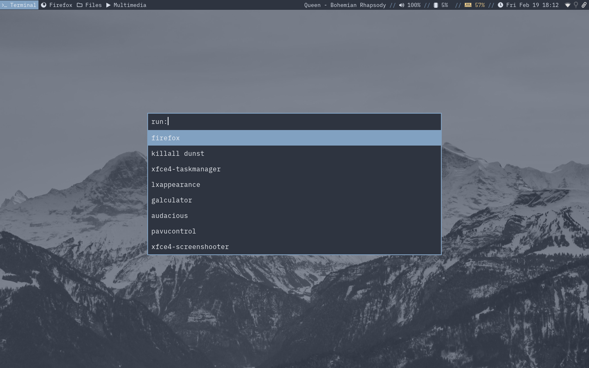
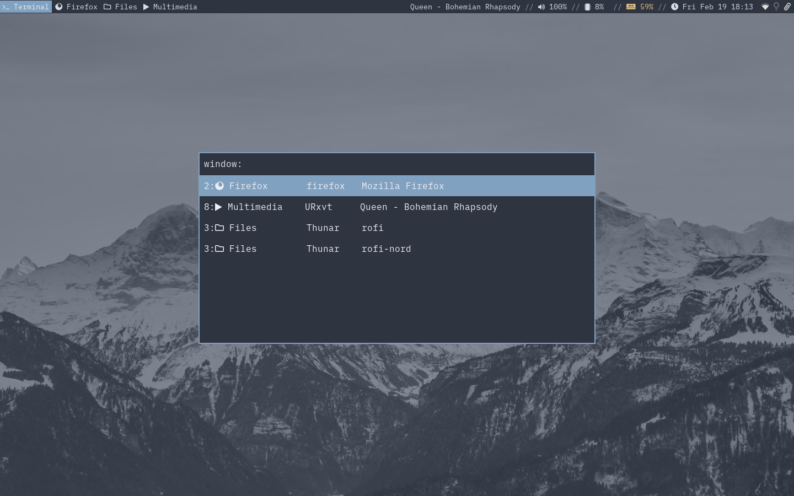

# This theme was merged to my [Rofi Themes Collection repo](https://github.com/lr-tech/rofi-themes-collection).

# ROFI NORD: A Rofi theme inspired by Nord Color Palette



## What is Rofi?

Rofi is A window switcher, Application launcher and dmenu replacement.
Rofi started as a clone of simpleswitcher and It has been extended with extra features,
like an application launcher and ssh-launcher, and can act as a drop-in dmenu replacement,
making it a very versatile tool. Rofi, like dmenu, will provide the user with a textual list of
options where one or more can be selected. This can either be running an application, selecting
a window, or options provided by an external script. You can learn more about Rofi [here](https://github.com/davatorium/rofi).

## Don't have rofi yet? Install it!

- On Debian / Ubuntu : `apt-get install rofi`
- On Arch / Arch-based : `pacman -S rofi`
- On Fedora : `dnf install rofi`

> You can learn how to set Rofi shortcuts and more [here.](https://github.com/davatorium/rofi)

## Install Nord Theme from terminal

1. Clone this repository and change to its directory:
```
$ git clone https://github.com/lr-tech/rofi-nord.git
$ cd rofi-nord
```

2. If you don't have the directories needed for the install create them with:
```
$ mkdir -p ~/.config/rofi/
$ mkdir -p ~/.local/share/rofi/themes/
```

3. Copy `nord.rasi` and `config.rasi` to its respective directories:
```
$ cp nord.rasi ~/.local/share/rofi/themes/
$ cp config.rasi ~/.config/rofi/
```

4. Run Rofi and enjoy your Nord Theme

## Install Nord Theme manually

1. Download using the [GitHub .zip download](https://github.com/lr-tech/rofi-nord/archive/main.zip).
2. Unzip
3. Copy the `nord.rasi` file into `~/.local/share/rofi/themes` (if you don't have the directories just create them).
4. Copy the config.rasi file into `~/.config/rofi`.
5. Run Rofi and enjoy your Nord Theme


## Screenshots
- Modi Run


- Modi Drun


- Modi Window


## FAQ

- Why Nord?
  - Nord is a beautiful color palette. Includes a total of sixteen pastel colors which IMO are elegants and relaxing.
    You can visit the Nord Project [here](https://github.com/arcticicestudio/nord).

